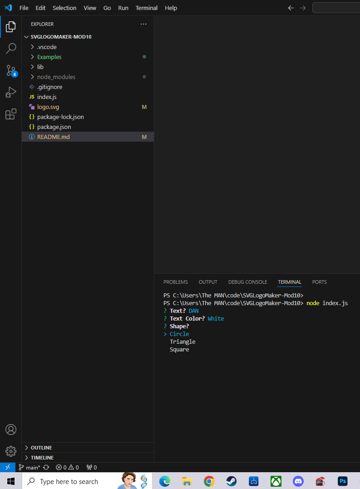

# SVG LOGO MAKER
## Description
Create your own svg logo consisting of a colored shape of your choosing  and a 3 character line centered in the middle.
## Installation
Download this repo on GitHub: https://github.com/WickedDan/SVGLogoMaker-Mod10.git
## Usuage Information
Run node index.js in your terminal.
## Contribution Guidelines
N/A
## Questions 
If you have questions check out my github WickedDan or you can email me at daniel@wickedflow.com;
## Screenshots

## Deployment Link
https://github.com/WickedDan/SVGLogoMaker-Mod10.git
## License

            